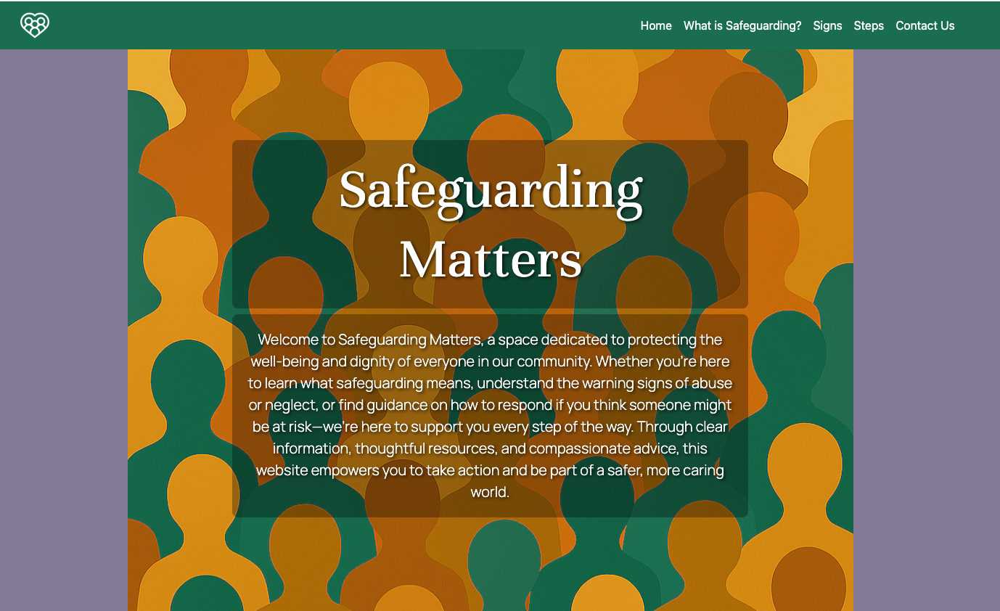
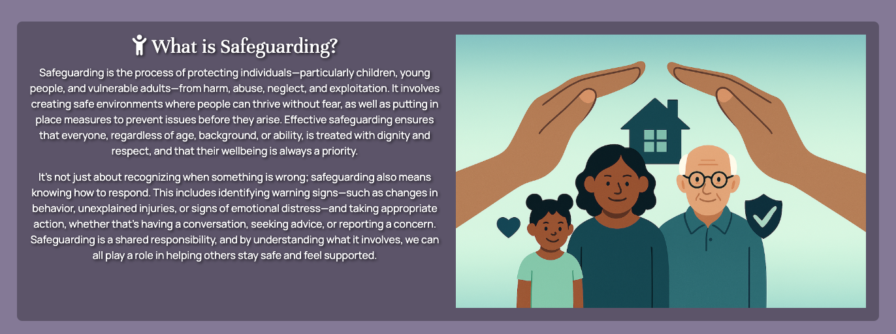
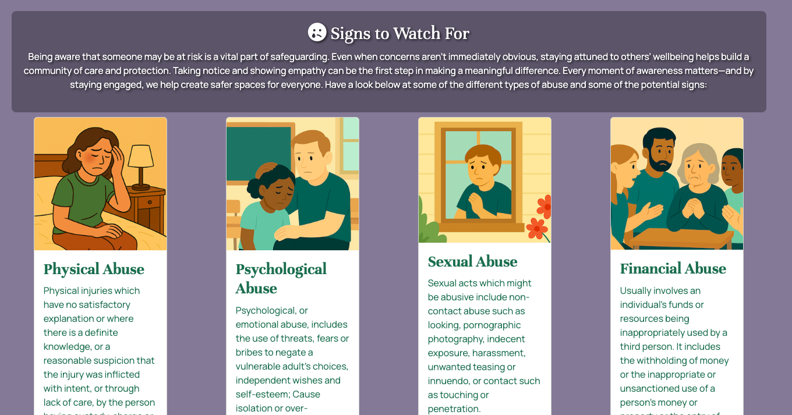
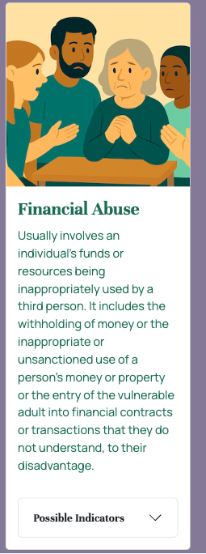
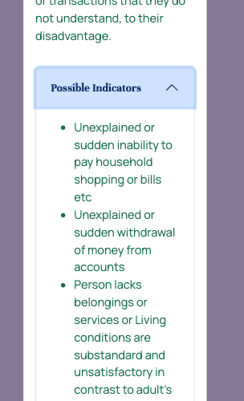
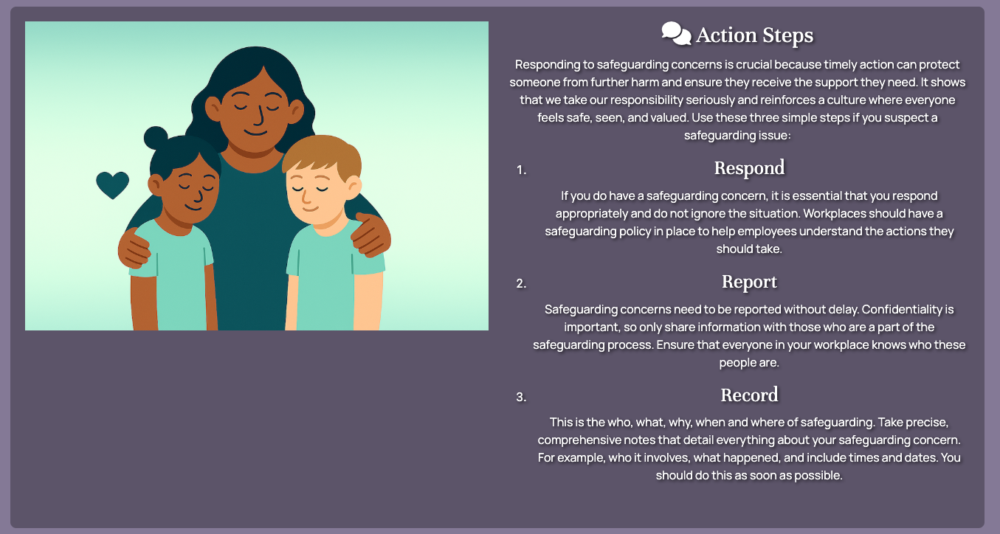
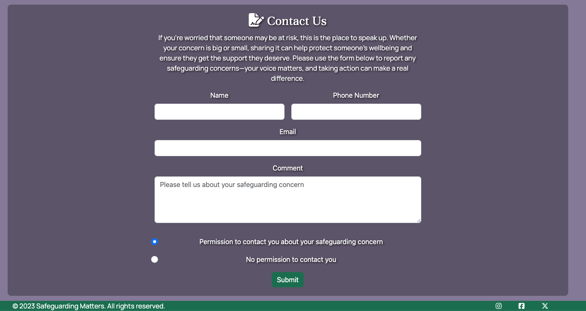
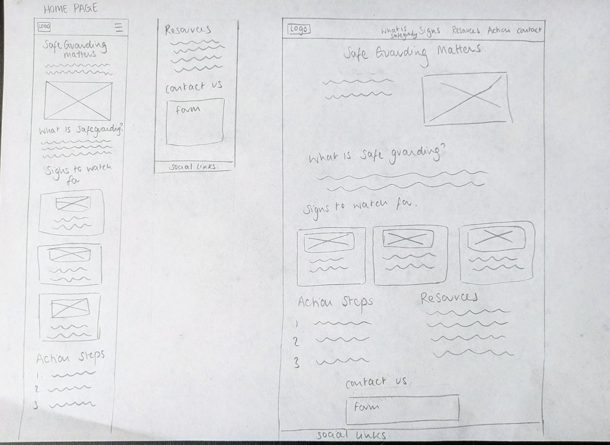

# safeguarding matters

## Description
The primary objective of the website was to provide external users with clear, accessible information about safeguarding practices. The content was designed to highlight key indicators that may suggest an individual requires safeguarding support, along with guidance on how to respond appropriately. By presenting this information in a structured and intuitive format, the site aimed to raise awareness and promote confident, informed action in safeguarding situations.

## User Stories:
**As a concerned individual**, I want to quickly understand what safeguarding means, so I feel confident knowing whether a situation is cause for concern. 
**As a visitor who suspects abuse or neglect**, I want to learn the common signs to watch for, so I can make an informed decision about whether to report it. 
**As someone who wants to help**, I want simple action steps listed clearly, so I can respond appropriately in a safeguarding situation. 

The website was created using HTML, CSS and Bootstrap. Fonts were sourced from GoogleFonts and Icons were used from Font Awesome.

## Features:
### Navigation and hero section

### Description outlining what safeguarding is

### Signs

### Steps

### Contact and Footer

## Future features
To make the site even more useful, I’d like to add a resources section with links to other websites that offer helpful information on different safeguarding topics. I’m also planning to expand the contact section to include phone numbers and email addresses for emergency services and organisations that support areas like domestic violence, children’s services, and older adults. These additions would make it easier for users to find support and learn more if they need it.

## Wireframes
Wireframe showing the initial website design for Safeguarding Matters. The layout features a navigation bar at the top, a hero section with a prominent heading, and clearly defined sections for description, signs, steps, contact information, and footer. The wireframe uses soft colors and rounded shapes to create a calm, welcoming atmosphere. Text in the wireframe includes section labels such as Navigation, Hero, Description, Signs, Steps, Contact, and Footer. The overall tone is professional and reassuring, emphasizing clarity and accessibility.

## Design choices and Typography 
In the planning stage, I looked at other websites for inspiration for the overall theme and feel of the website. I wanted the website to have a calm and inviting feel while also still remaining professional due to the serious content of the website. This is the initial colour palette I chose for the project:

## AI Usage:

I used AI to help assist with the development of the project. This included:
- To generate website images
- To help create user stories
- Used to create some of the meta content of the HTML
- Spot and fix errors in the coding content
- Help with overall problem-solving

## Testing and validation

## Refection
Looking back on this project, I’m not fully satisfied with the final website. It feels incomplete and lacks the cohesive visual quality I had initially envisioned. I believe this outcome was largely due to challenges with time management and a lack of structured planning. 

In future projects, I aim to improve the prioritisation of my time and tasks. A significant amount of effort went into researching colour palettes, typography, and generating AI-based imagery—many of which were ultimately excluded from the final design. While this exploration was valuable, it came at the cost of progress on core development. 

One key takeaway is the importance of a focused and sequential workflow. During this build, I jumped between sections, which disrupted my momentum and made it harder to track progress. I believe I could produce a cleaner and more cohesive site by completing each section methodically before moving on.